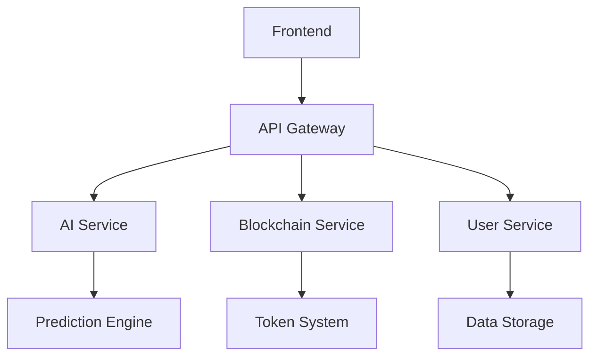

# Inversion


## Project Overview
Inversion is an AI-driven future simulation system combined with blockchain technology. Our vision is to help users preview and optimize their life trajectories through AI simulation, while building a token-based future exploration community.

## Core Features
- Future Diary: Preview your future experiences
- Future Self Dialogue: Interact with AI-generated future versions of yourself
- Dynamic Future Rewriting: See how your choices impact your future
- Future Exploration Mode: Simulate different life paths

## Technical Architecture
The project is built with a modern tech stack focusing on AI, blockchain, and web technologies.

### System Architecture


## Getting Started

### Prerequisites
- Node.js >= 16
- Python >= 3.8
- Solidity >= 0.8.0

### Installation
```bash
# Clone the repository
git clone https://github.com/InversionAi/InversionAi.git

# Install dependencies
npm install
```

## Project Structure
```
inversion/
├── frontend/           # React-based frontend
├── backend/           # Python-based backend services
├── smart-contracts/   # Solidity smart contracts
├── ai-models/        # AI prediction models
└── docs/            # Project documentation
```

## Contributing
Please read [CONTRIBUTING.md](CONTRIBUTING.md) for details on our code of conduct and the process for submitting pull requests.

## License
This project is licensed under the MIT License - see the [LICENSE](LICENSE) file for details.

## Social Links
- Twitter: [@Inversion_Ai](https://x.com/Inversion_Ai)
- GitHub: [InversionAi](https://github.com/InversionAi/InversionAi) 